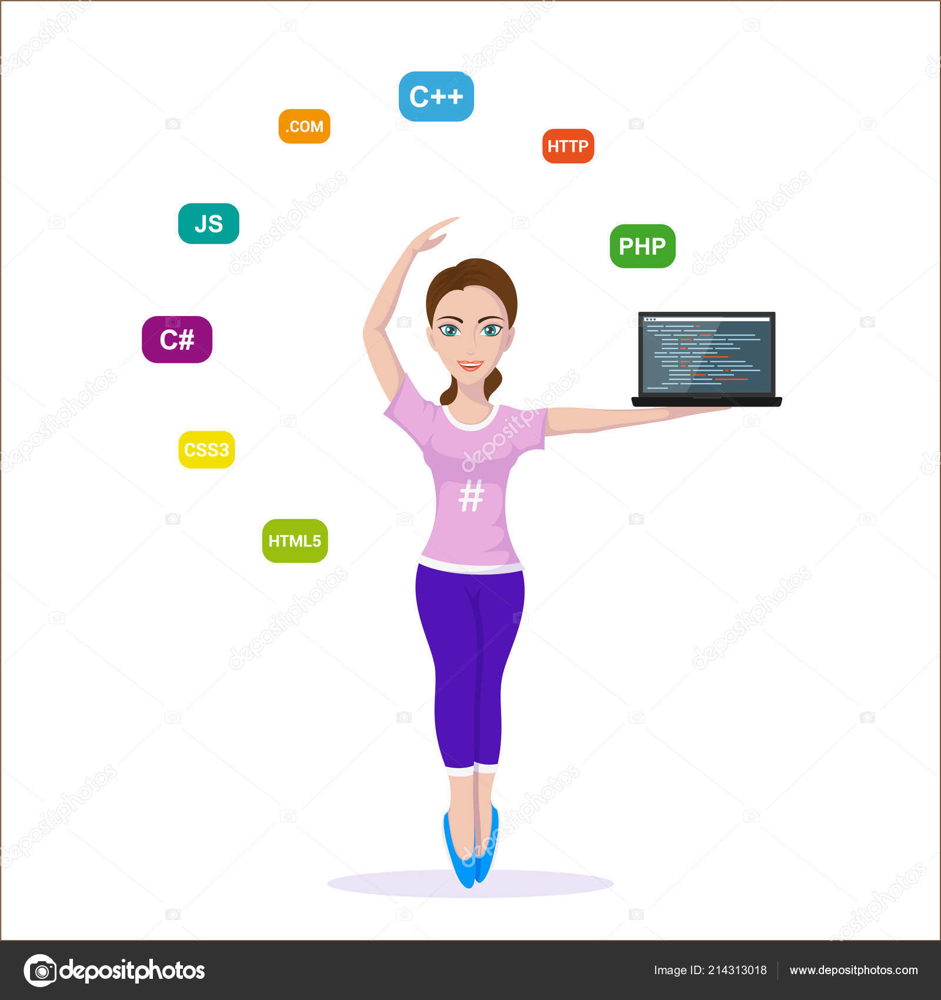

<b>Cтародубец Владислава, 19 лет
Занимаюсь программированием более года, уже знаю С/С++ и имею 2 готовых учбеных проекта. Также есть опыт работы в команде, умею пользоваться Git. 
Имею сертификат Cisco ( Компьютерная инженерия, Программное обеспечение, Сетевые технологии) 
В своих новых проектах учусь использовать TDD и шаблоны проектирования
Есть знания MSSQL
Сейчас изучаю C#+ADO.NET, HTML+CSS5+Javascript </b>

